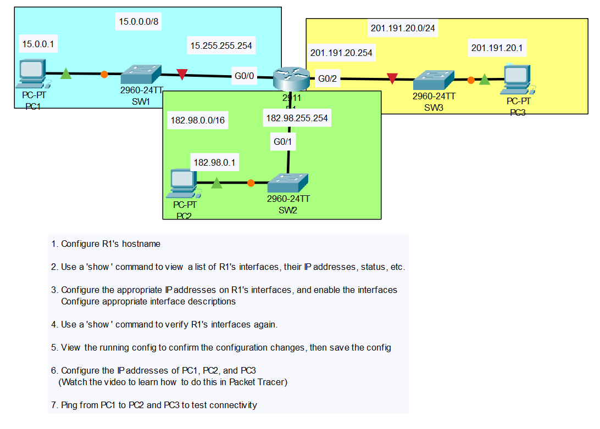
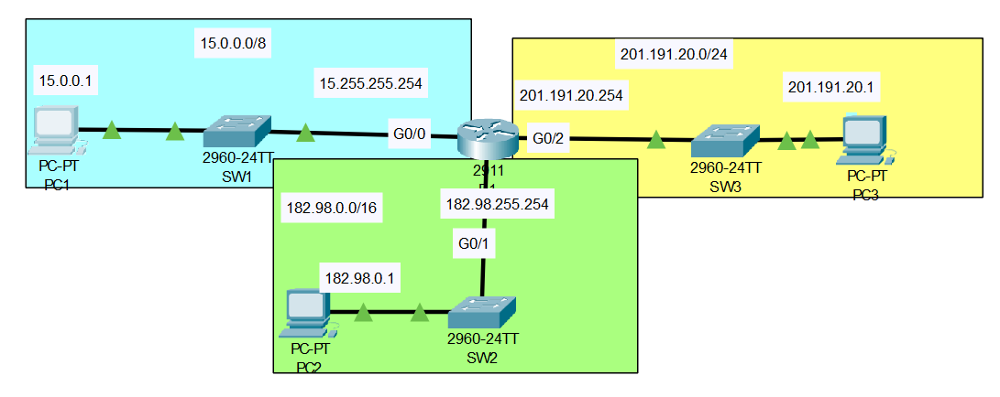

# Lab 2: Basic Router Configuration

## Lab Objective
Configure Router R1 hostname, interface IP addresses, and descriptions. Assign static IP addresses to PC1, PC2, and PC3, then verify end-to-end connectivity with ping tests.

## Why This Matters
In data center operations, properly configuring router interfaces and IP addressing is essential for connecting server subnets, management networks, and storage systems. These skills are used daily when deploying new racks, troubleshooting inter-device connectivity, or verifying that servers can reach the rest of the infrastructure.

## Key Concepts Practiced
- Router hostname configuration
- Interface status verification using `show` commands
- Assigning IPv4 addresses and subnet masks to router interfaces
- Enabling interfaces (`no shutdown`) and adding descriptions
- Viewing and saving the running configuration
- Static IP configuration on end devices in Packet Tracer
- Basic connectivity testing with ping across multiple networks

## Steps Completed
1. Configured R1's hostname.
2. Used `show` commands to view R1's interfaces, IP addresses, and status.
3. Configured the following on R1's interfaces (GigabitEthernet0/0, 0/1, 0/2):
   - Correct IP addresses and subnet masks per the topology
   - Enabled each interface (`no shutdown`)
   - Added clear interface descriptions
4. Verified the configuration with `show ip interface brief` again.
5. Viewed the running configuration and saved it (`copy running-config startup-config`).
6. Configured static IP addresses on PC1, PC2, and PC3 (including correct subnet masks and default gateways).
7. Pinged from PC1 to PC2 and PC3 to confirm full connectivity.



**Example commands used on R1 (CLI):**

```bash
Router> enable
Router# configure terminal
Router(config)# hostname R1
R1(config)# interface GigabitEthernet0/0
R1(config-if)# ip address 15.255.255.254 255.0.0.0
R1(config-if)# description Link to SW1
R1(config-if)# no shutdown
! (similar blocks for G0/1 and G0/2)
R1# show ip interface brief
R1# show running-config
R1# copy running-config startup-config
