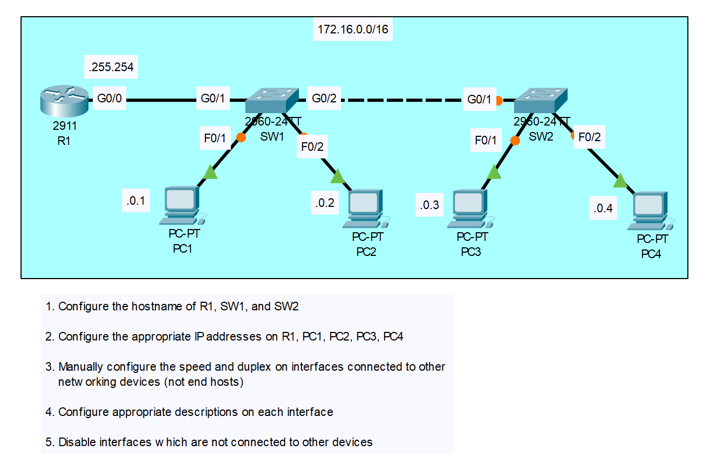
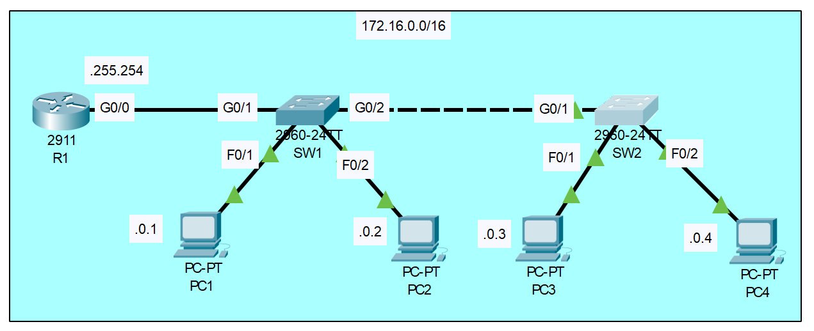

# Lab 3 - Basic Device Configuration

Date Completed: 5/31/26

## Lab Objective
1. Configure the hostname of R1, SW1, and SW2  
2. Configure the appropriate IP addresses on R1, PC1, PC2, PC3, PC4  
3. Manually configure the speed and duplex on interfaces connected to other networking devices (not end hosts)  
4. Configure appropriate descriptions on each interface  
5. Disable interfaces which are not connected to other devices  

## Why This Matters
In a real data center, clean initial device configuration is critical. Accurate hostnames and clear interface descriptions help the team quickly understand the topology when troubleshooting or adding new servers. Manually setting speed/duplex prevents negotiation issues on important links, and disabling unused interfaces is a key security best practice before putting equipment into production.

## Key Concepts Practiced
- Hostname configuration on Cisco routers and switches  
- IPv4 address assignment on router interfaces and end devices  
- Manual speed and duplex settings on inter-device links  
- Adding clear descriptions to interfaces for documentation  
- Administrative shutdown of unused interfaces (security & best practice)  

## Steps Completed
1. Configured the hostname of R1, SW1, and SW2  
2. Configured the appropriate IP addresses on R1, PC1, PC2, PC3, and PC4  
3. Manually configured the speed and duplex on interfaces connected to other networking devices (not end hosts)  
4. Configured appropriate descriptions on each interface  
5. Disabled interfaces which are not connected to other devices

Screenshots

